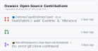

# GitHub Contributions Widget

[Latest Version]: https://img.shields.io/crates/v/package_manager_detector_rs.svg

[crates.io]: https://crates.io/crates/package_manager_detector_rs

[Rustc Version]: https://img.shields.io/badge/rustc-1.56+-lightgray.svg

[rustc]: https://blog.rust-lang.org/2021/10/21/Rust-1.56.0.html

📷 Show your dynamically generated GitHub contributions to your GitHub profile or your website!

## Usage

Easily showcase your GitHub contributions to your profile! Follow the steps below:

1. Copy the code snippet below and paste it into your `README.md` file
2. Replace `/oxwazz` with your GitHub username (case-sensitive)

```markdown

```

**Output** <br/>


Congratulation! 🎉 You are now showing your GitHub contributions to your profile!

## FAQ

1. why the widget is not updated / always cached? that causing my latest contributions not listed

> GitHub has image caching by default, this causing your latest contributions not reflect on this widget.
> to solve this issue you can manually update the image using query params like `?refresh-cache=1`
> or you can auto update the `?refresh-cache=` automatically using GitHub Action
> like [probablykasper/readme-template-action](https://github.com/probablykasper/readme-template-action)
> you can [see the example](https://github.com/oxwazz/oxwazz) in my repository.

## License

[MIT](./LICENSE) License © 2024-PRESENT [Muhammad Rahmahalim](https://github.com/oxwazz)